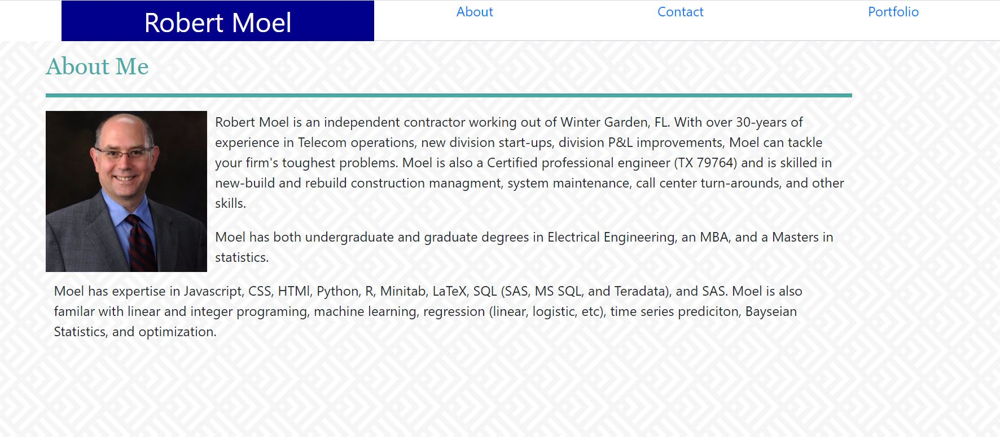

## Portfolio Refactored with React
Portfolio page refactored to use React

        

## Description
This application uses React, Router, and other React elements to render the front-end of this application.
        
# Table of contents
1. [Installation](#installation)
2. [Usage](#usage)
3. [License](#license)
4. [Contributing](#contributing)
5. [Tests](#tests)
6. [Questions](#questions)

## Installation <a name="installation"></a>
The following dependencies need to be installed

```
npm i react, react-router-dom, react-bootstrap.  In any event, run npm i  
```


## Usage <a name="usage"></a>
Displaying your portfolio with the latest web technology is critical to displaying your skills and talents.

## License <a name="license"></a>
None.

## Contributing <a name="contributing"></a>
None
        
## Tests <a name = "tests"></a>

```
none

```

## Questions <a name ="questions"></a>
 

If you have an questions about the repo, open an issue or contact [randrmoel](https://api.github.com/users/randrmoel)
at my email: robert.moel@rvmconsulting1.com
